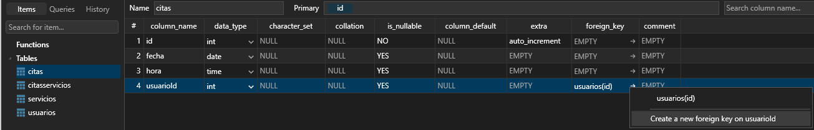
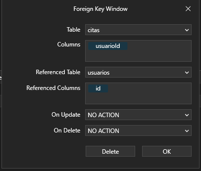

# Proyecto Barberia

## Tecnologías y/o Herramientas Utilizadas

- HTML5
- SASS
- JAVASCRIPT
- GULP
- NPM
- ACTIVE RECORD
- COMPOSER
- MAILTRAP
    - Integrations: **_PHPMailer_**
    ```
        $phpmailer = new PHPMailer();
        $phpmailer->isSMTP();
        $phpmailer->Host = 'sandbox.smtp.mailtrap.io';
        $phpmailer->SMTPAuth = true;
        $phpmailer->Port = 2525;
        $phpmailer->Username = 'te lo da la página';
        $phpmailer->Password = 'te lo da la página';
    ```
- PHPMAILER
    - **_composer require phpmailer/phpmailer_**
- MYSQL
- PHP (MVC)
- SWEET ALERT2
- POSTMAN

### Descripción

- Proyecto diseñado para una barberia o un salón donde se lleva a cabo el registro de citas, servicios, autenticación mediante token, control mediante un ADMIN y generando vistas distintas a los usuarios, adaptación a distintos dispositivos, código limpio y buenas prácticas utilizando arquitectura MVC.

#### Sitio

- **[barber]()**

#### Primeros Pasos

- **_npm install_**
- **_npm run gulp_**
    - Se crea el: **_build_**
- **_composer init_**
    - omar/barber
    - proyecto php 8, mvc, mysql, sass, gulp
    - enter
    - project
    - (require) interactively: NO
    - (require-dev) interactively: NO
    - confirm generation?: yes
        - Se crea el: **_composer.json_** y el **_vendor_**
    - En el archivo: **_composer.json_**, configuramos lo siguiente:
        ```
            "autoload": {
                "psr-4": {
                    "MVC\\": "./",
                    "Controllers\\" : "./controllers",
                    "Model\\" : "./models"
                }
            },
        ```
    - Después ejecutamos:
        - **_composer update_**
        - Nota: Cada vez que agregue o modifiquemos algo de: **_composer.json_**, tenemos que ejecutar:
            - **_composer update_**

#### Base de Datos

- utf8
- utf8_general_ci

    ## Restricciones de Integridad Referencial
    
    - Ejemplo en tabla:
        - **Barbaeria**
        - 
        - Damos click sobre: **usarioId** para que nos despliegue lo siguiente:
        
            - **_NO ACTION / RESTRICT_**:
                - (Son lo mismo), Van a RESTRINGIR y no van a permitir eliminar un registro que ya esta en otra tabla
            - **_CASCADE_**
                - Si eliminas el PADRE, eliminará los dependientes también
            - **_SET NULL_**
                - Ejemplo, si tenenmos un USUARIO y en CITAS estaba relacionado con el USUARIO que creo esa cita, si borramos al USUARIO lo que hace es ELIMINAR al USUARIO, pero en CITAS solo pondrá el campo de: usuarioID a NULL, es decir; borra el USUARIO pero no BORRA los datos, lo que estaba relacionado lo pondrá en NULL.
            - **_SET DEFAULT_**
                - 
    - Las tablas que tiene llaves FORÁNEAS, se dejan en:
        - **_SET NULL:**

#### API

- Application Programming Interface

    ## ¿Qué es?
        - Es básicamente una capa de abstracción que nos permite conectarnos a un servicio.
        - Usualmente una API debe soportar los 4 verbos del CRUD.
        - Tiene una forma muy organizada de poner a disposición los datos.
        - Una REST API cuenta con Endpoints (o URLS) para hacer operaciones CRUD.
        - Ejemplo:
            - Listar los clientes GET /clientes
            - Obtener 1 solo cliente GET /clientes/10
            - Crear nuevo cliente POST /clientes
            - Editar un contacto PUT /clientes/3
            - Borrar un contacto DELETE /clientes/8
        - Usualmente una API es creada en JSON.
        